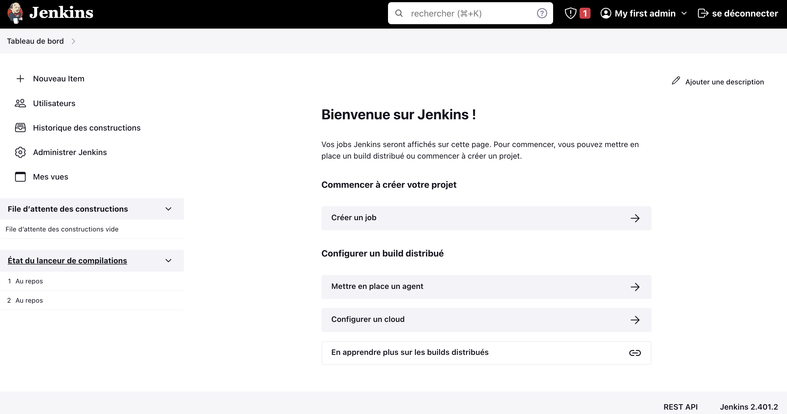

# Our first Jenkins job

>New item> to create new job
 - Build History
 - Manage Jenkins
 - Add / remove plugin
 - Troubleshoot some issues
 - Credentials
 - Execution
 - ...
> Create new job > freestyle project
  Execute shell
     echo "Hello first job"

